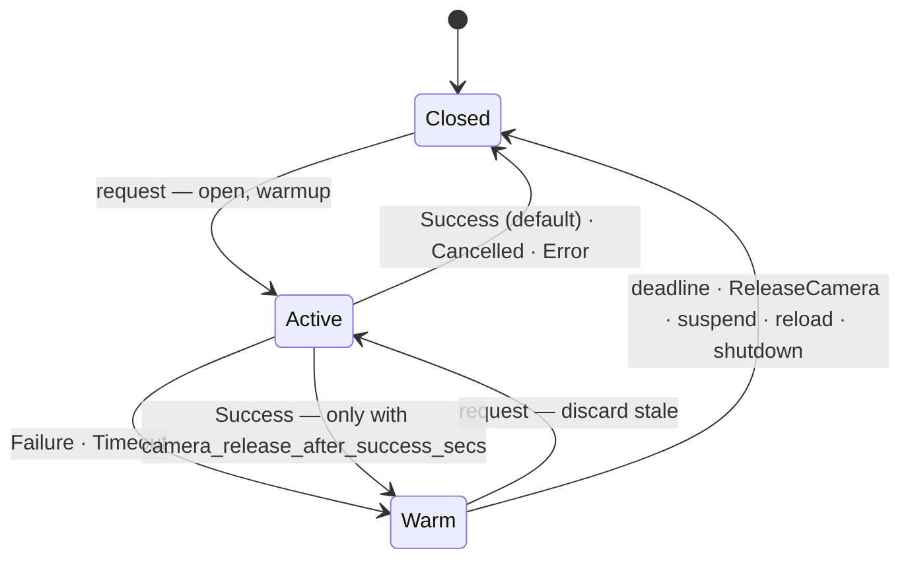

# ADR 008: Outcome-Based Camera Hold and Cancellable Authentication

## Status

Accepted

## Date

2026-08-15

## Decision

The camera is on only while an authentication is in progress or a retry is
plausibly imminent. Success, cancel, and error release the camera immediately;
a no-match/timeout keeps it warm for `device.camera_release_secs` (default 3,
`0` = never; previously 5 after every request). Every in-flight request carries
a cancel token set when the caller's bus connection disappears, on
suspend/shutdown, or (one-shot) on SIGTERM. Warm reuse discards the stale V4L2
buffers first. One-shot loads the engine before opening the camera and dies with
its PAM host. `recognition.no_face_timeout_secs` (default 2) ends attempts at an
empty chair early and such attempts never charge the rate limiter. No config
migration is required.

The full design, flows, failure handling and validation plan follow.

---

How long the camera stays open around an authentication, in daemon and one-shot mode.
Baseline `main` @ `7def547`. Motivation: [omarchy#4982](https://github.com/basecamp/omarchy/discussions/4982) (LED strobes for the 5 s hold) and [omarchy PR #6863](https://github.com/basecamp/omarchy/pull/6863) (auto-start, 3 × 250 ms retries, password typed in parallel, PAM aborted on unlock/lid-close).

## 1. Principle

**The camera is on only while an authentication is in progress or a retry is plausibly imminent.**
Success, cancel, and error end the interaction → release now. No-match/timeout predicts a retry → keep warm briefly. Anything the daemon can't see (a client that already left) must be made visible, because an invisible cancel is a timeout, and a timeout keeps the camera on.

## 2. Today → after

| | Today | After |
|---|---|---|
| Hold | live V4L2 stream for `camera_release_secs` (5) after *every* request; `0` silently = 5; released by a 1 s `try_lock` poll (`server.rs:1320-1350`, `handler.rs:320-329`) | stream held **only after a failed attempt**, `camera_release_secs` = **3**, `0` = no hold, 250 ms poll; a success holds only if `camera_release_after_success_secs` is set (default `0`, §3) |
| Warm reuse | dequeues up to 3 stale frames from the hold (`handler.rs:332-359`) | discards `MMAP_BUFFERS − 1` frames first (same helper as cold warmup) |
| Cancel | none — scan runs to `timeout_secs` after the client is gone (`auth.rs:543-572`); polkit agent's cancel only drops its future (`facelock-polkit/src/main.rs:52-102`) | per-request cancel token; set when the caller's bus connection vanishes, on suspend/shutdown, or (one-shot) on SIGTERM |
| One-shot | opens camera before loading the engine (`cli/commands/auth.rs:130-160`); PAM SIGKILLs a slow child (`pam-facelock/src/lib.rs:836-870`); child can outlive its PAM host | engine first; SIGTERM handled → clean `Drop`; `PR_SET_PDEATHSIG` |
| No face | scans full `timeout_secs`, charges the rate limiter | ends at `no_face_timeout_secs` (2), never charges |
| Reopen cost | asserted ~400 ms (`docs/architecture.md:211`), never measured | `bench camera-reopen` |

## 3. Configuration

```toml
[device]
# Daemon only. Seconds to keep the camera streaming after a FAILED attempt so a
# retry skips reopen (~0.4 s). Cancel and errors always release at once.
# 0 = never hold.
camera_release_secs = 3

# Opt-in: hold after a SUCCESSFUL attempt too. 0 = release at once (default).
camera_release_after_success_secs = 0

[recognition]
# End an attempt after this many seconds if no face at all has been seen.
# timeout_secs still bounds "face seen, not yet matched". 0 = disabled.
no_face_timeout_secs = 2
```

**Compatibility — no migration.** `/etc/facelock/config.toml` is a protected conffile in every package (`backup=`, `%config(noreplace)`, dpkg conffile); the shipped template has every key commented out; `facelock setup` writes only device path / provider / encryption / models. So:

- `camera_release_secs` is reused unchanged in name and type. Almost every install has it unset → the new default (3) applies on upgrade with no file change. Explicit values keep working and now apply after failure only. `0` was silently 5 — nobody set it wanting 5 — so honoring it is a fix, not a migration. No `config --edit` restart entry needed: the daemon live-reloads and reads it per request.
- `no_face_timeout_secs` is additive with a serde default. Effective value is `min(no_face_timeout_secs, timeout_secs)`, `0` disables; it never rejects an existing config (a user with `timeout_secs = 2` sees identical behavior). PAM's private schema ignores it (no `deny_unknown_fields`; template parity test unaffected because the template key ships commented).
- Everything else — success/cancel release, stale discard, cancel token, no-face not charging the limiter, one-shot ordering/signals — is behavior with no config surface.

Docs touched: template comment, `docs/configuration.md`, `docs/contracts.md` wording, CHANGELOG, one upgrade-notes line ("no action required").

**`camera_release_after_success_secs`, added after the fact.** This key was deferred here — sudo `timestamp_timeout` and polkit `auth_admin_keep` already cache successes, so on most setups a hold after a success only lights the IR emitter for a retry nobody makes — and was then added on maintainer request as an opt-in, default **0**, which is byte for byte the behavior described above. Non-zero keeps the stream warm after a success for that many seconds, for the flows those caches are turned off in (`timestamp_timeout=0`, no `auth_admin_keep`), where every privileged action is a fresh authentication that pays a reopen. Additive with a serde default, so it rejects no existing config and needs no migration, and the daemon reads it per request like its sibling. Failures still use `camera_release_secs`; cancel and error still release at once regardless of either key.

## 4. Daemon lifecycle



**`CameraLease`** — one struct inside `Handler` owning `camera: Option<C>` and `deadline: Option<Instant>`. All request arms use it; nothing else touches the camera or the deadline. The cancel token is *not* a field: it belongs to the request, arrives as an argument to `acquire`, and dies with the request (§5).

```rust
fn acquire(&mut self, cfg, cancel) -> Result<&mut C>   // Closed: open + discard(warmup)  |  Warm: discard(MMAP_BUFFERS-1); clears deadline
fn finish(&mut self, outcome: Outcome)         // Cancelled|Error → drop camera; Failure → deadline = now + release_secs; Success → drop, or deadline = now + release_after_success_secs when that is set (both: drop if 0)
fn touch_preview(&mut self)                    // deadline = now + max(release_secs, PREVIEW_MIN_HOLD=2s)
fn expire(&mut self, now)                      // deadline passed → drop camera   (called from the 250 ms poll)
```

`Outcome` is derived from `AuthOutcome` in one `From` impl (`Success` matched; `Failure` = `matched=false` incl. timeout; `Cancelled`; `Error` = every `ErrorKind` incl. `AllFramesDark`, camera/capture errors). Enroll: stored ≥ min → Success, deadline hit → Failure. `TestAuthenticate` follows the same rule (a repeated `facelock test` is human-paced).

| Request | Camera |
|---|---|
| `Authenticate`, `TestAuthenticate`, `Enroll` | `acquire` → run → `finish(outcome)` |
| `PreviewFrame`, `PreviewDetectFrame` | `acquire` → capture → `touch_preview` (a preview streams at ~10 fps; must not reopen per frame even with `release_secs = 0`; CLI exit still calls `ReleaseCamera`) |
| `ReleaseCamera` (root) | set cancel, drop camera |
| Config reload, `Shutdown`, SIGTERM/idle | handler dropped → camera dropped (`Drop` disables the IR emitter) |
| logind `PrepareForSleep(true)` | set cancel (lock-free), then drop camera — replaces today's `try_lock`/"busy" warning |
| Second request while `Active` | capture slot "busy" error, unchanged; PAM degrades to password |

Warm reuse skips warmup (AE is settled) but discards `MMAP_BUFFERS − 1` frames: V4L2 leaves those buffers filled with the frames right after the last capture, and they would otherwise be analyzed first. ≤100 ms, closes the "matched on the previous auth's tail" window.

## 5. Cancellation

One token **per request**, one rule: **the request ends within one frame, `finish(Cancelled)`, no rate-limit charge, audit `cancelled`.** The auth loop (`auth.rs:572`), enroll loop (`enroll.rs:187`), and both discard loops check the token per iteration — including a cancellation noticed before the camera opens, which audits the same way with `frame_count: 0`.

The token is minted by the `#[interface]` glue for the one call it belongs to, and there is deliberately no way to clear one. zbus dispatches each method in its own task, so a token shared across calls is shared across *concurrent* calls: a second caller (even one about to be denied) could clear the flag an in-flight request had not read yet, and a departure watch subscribed against it could cancel a request that was never its caller's. Fresh and un-cancelled are therefore the same statement. Suspend, `ReleaseCamera` and shutdown reach the running request through a small lock-free slot on the service holding the token of whichever request currently owns the capture slot; it is published only *after* authorization and the capture-slot claim, and generation-checked on clear, so a rejected or already-finished request can neither displace nor erase the entry of the one actually running.

Who sets it:

| Source | Mechanism |
|---|---|
| Caller's bus connection disappears — PAM host aborted/killed (omarchy shell `abort()`, sudo exit), CLI Ctrl-C, client crash | Per request: glue takes `hdr.sender()`, races the blocking work against `DBusProxy::receive_name_owner_changed_with_args([(0, sender)])`; a `(sender, old, "")` event sets the token. Subscription failure → log, degrade to timeout-bounded (today). A client that dies before we subscribe is missed → also timeout-bounded, accepted. |
| polkit agent `CancelAuthentication` | Agent uses a **dedicated `Connection::system()` per `Authenticate`** and drops it on cancel — same mechanism, no new API. |
| Suspend, `ReleaseCamera`, shutdown | Set the in-flight request's token through the service's current-request slot (it's an `Arc<AtomicBool>`, no handler lock needed). Nothing in flight → nothing to cancel. |
| One-shot: SIGTERM/SIGINT/SIGHUP, parent death | `signal_hook::flag::register` into the same token type; PDEATHSIG delivers SIGTERM (§7). |

Not doing (until a client needs it): an explicit `Cancel()` D-Bus method. If Quattro's PAM helper turns out to keep its connection alive across `abort()`, that is the moment to add it — one method, caller-UID authz.

`Ctrl-C` on `sudo` is ambiguous ("never mind" vs "again"); cancel wins — LED off is the unambiguous expectation, a retry pays one reopen. Whether sudo tears down mid-`pam_authenticate` is to verify on hardware; if it defers, nothing regresses.

## 6. Flows (defaults: 3 s window, `timeout_secs` 5, `no_face` 2, reopen ≈ 0.4 s)

| Surface · flow | Daemon outcome | Camera / LED |
|---|---|---|
| Omarchy lid open → match | Success | off ≤ 100 ms after unlock |
| Omarchy try 1 misses, try 2 (+250 ms) matches | Failure → Warm; warm reuse; Success | on through both, no reopen, off at unlock |
| Omarchy three misses (backlight) | 3 × Failure (≤ 5 s each, face seen) → Warm | on ≤ 15 s + 3 s, off; user types password |
| Omarchy lid open, nobody there | 3 × Timeout at 2 s, not charged | on ≤ 6 s + 3 s |
| Omarchy password typed first / lid closed / unlock | shell aborts PAM → connection gone → Cancelled | off ≤ 100 ms (today ≈ 10 s) |
| Omarchy key press after the misses | Warm if < 3 s since last failure, else cold | — |
| hyprlock Enter → match / miss → Enter again / miss → password | Success / Failure→Warm→warm reuse / Failure→Warm→expire | off at unlock / on through both / on 3 s then off |
| sudo match; second sudo soon after | Success; **usually no request** (sudo cache) | off before the command runs |
| sudo miss → password prompt | Failure → Warm 3 s | strobe 3 s while typing; `0` removes it |
| sudo miss → Ctrl-C → rerun | Cancelled → cold rerun (or Failure → warm rerun if sudo defers) | either satisfies §1 |
| polkit match / dialog Cancel / miss | Success / Cancelled (dedicated connection dropped) / Failure → Warm | off with dialog / off ≤ 100 ms / 3 s |
| `facelock test`, `enroll` (Ctrl-C) | Success → off; Cancelled via connection drop | off before the prompt returns |
| `facelock preview` | rolling `touch_preview`; exit → `ReleaseCamera` | off ≤ 2 s after even a crashed preview |
| Suspend mid-scan | Cancelled, closed | off before sleep |
| Rate-limited / lid closed / ssh / IR required | Error before open | never on |

## 7. One-shot mode

Never holds; exit is the release. `camera_release_secs` ignored.

```
pre-flight gates → load engine → open camera + discard(warmup) → scan (token, no_face, timeout) → Drop (STREAMOFF, emitter off) → exit 0/1/2
```

- Engine before camera: LED-on time = scan time (today it spans model load).
- `facelock auth` registers SIGTERM/SIGINT/SIGHUP → token → clean `Drop`, exit 2, log `cancelled`. Existing exit-code contract unchanged.
- `pre_exec`: `prctl(PR_SET_PDEATHSIG, SIGTERM)` so an aborted PAM host (killed quickshell helper, killed sudo) takes the child with it — the one-shot analogue of the connection watch.
- PAM child timeout: SIGTERM, wait ≤ 500 ms, then SIGKILL (today: SIGKILL only, which skips `Drop` and leaves an XU-controlled emitter on).
- Fallback while the daemon holds the camera: `STREAMON` → `EBUSY` → exit 2 → `PAM_IGNORE` → password. Logged with device path; rarer with a 3 s window; not worth evicting the daemon.

## 8. Failure handling

Invariant (tested): **every exit from `Active` either sets a deadline or drops the camera.**

| Failure | Behavior |
|---|---|
| Camera open error / capture error mid-scan / warm-reuse `next()` error | `Error` → drop camera (never `Warm`); not charged; PAM degrades to password |
| Cancel token during warmup/stale discard | abort acquire → `Cancelled`, closed |
| Name-owner watch fails to subscribe | warn; that request is timeout-bounded as today |
| Poll tick lands while a request holds the lock | `try_lock` fails, retried 250 ms later; deadline is absolute so nothing is lost |
| Daemon crash while streaming | kernel closes fd (implicit `STREAMOFF`); if `ir_emitter = true`, daemon start runs `disable_emitter` once (idempotent) |
| Suspend while a request is stuck in the driver | token set (lock-free), then the handler mutex is polled for 1 s and the camera dropped as soon as it is free — the cancelled request exits within one frame, so this is the normal path. It cannot be dropped *out from under* a request still holding that mutex, so if the second still has not freed it, the suspend path warns and returns: the token is set, so the camera closes when the request returns, one frame later at worst. |
| Config reload while `Warm` | old handler dropped → closed; new value applies next request (reload only runs between requests) |
| PAM D-Bus timeout before the daemon answers | `PAM_AUTH_ERR`, no one-shot fallback (unchanged); daemon ends via its own deadline or the connection drop |
| One-shot SIGTERM during model load | token checked before open → exit 2, camera never touched |

## 9. Validation

**Config** — every existing config still parses (template + PAM parity tests); `no_face_timeout_secs` clamps to `timeout_secs` (no error); `camera_release_secs = 0` logs "camera hold disabled"; contract table test extended for the two keys.

**Daemon — unit** (mock `CameraSource`, mock clock): `Outcome` × `finish` matrix (table-driven over every `AuthOutcome`/`ErrorKind` variant so a new variant fails to compile until classified); `expire` at `deadline ± 250 ms`; `release_secs = 0` closes on Failure; warm reuse discards exactly `MMAP_BUFFERS − 1` and no warmup; token set at frame *k* → `Cancelled` before *k+1*, no limiter record, camera closed; `no_face` → Timeout at 2 s, `face_detected=false`, not charged; one detection → full timeout; preview floor with `release_secs = 0`; suspend with `Active`/`Warm`.
**Daemon — integration/container** (`just test-arch-integration`): kill client mid-`Authenticate` → journal `cancelled` < 200 ms + `releasing camera`; Failure → release at 3.0 ± 0.25 s; Success → release before the reply; polkit `CancelAuthentication` → `cancelled`.
**Daemon — hardware** (BRIO IR + one quirked camera): LED off ≤ 150 ms after match; off at 3 s after miss; Quattro + #6863 password-first unlock → LED off with the unlock (verifies the abort ⇒ connection-drop assumption); warm retry logs no `camera format negotiated`.

**One-shot — unit**: engine load precedes camera open (mock call order); token set before open → exit 2, factory never called.
**One-shot — container** (`just test-arch-oneshot`): PAM timeout → child gets SIGTERM, exits ≤ 500 ms, no SIGKILL, audit `cancelled`; kill PAM host → no `facelock auth` survives > 200 ms; daemon-held camera → exit 2 with `EBUSY` logged; 0/1 paths unchanged.
**One-shot — hardware**: Ctrl-C on hand-run `facelock auth` → LED off immediately, emitter disabled.

**Bench**: `facelock bench camera-reopen` — N × (drop → open → warmup → first frame), open/`STREAMON`/warmup split. Decides 3 s vs 2 s and replaces the "~600 ms cold" doc line.

**Acceptance**: (1) LED off ≤ one frame + 250 ms after Success/Cancel; (2) off at `release_secs ± 250 ms` after Failure; (3) warm retry: no `open()`/`STREAMON`, first analyzed frame is fresh; (4) no `facelock auth` outlives its PAM host by > 500 ms; (5) `release_secs = 0` never holds; (6) invariant in §8.

## 10. Delivery

**One PR, atomic commits, merge commit (not squash).** The pieces are genuinely stacked (`finish(Cancelled)` sits on `CameraLease`; the no-face timeout lives in the loop the cancel token threads through) and `ci.yml` runs only on `push: main` / `pull_request: main`, so stacked PRs would get no CI until each predecessor merged. One PR keeps one contract change, one CHANGELOG entry, one docs pass, one omarchy reply, and review happens commit-by-commit:

| Commit | Scope | Contract |
|---|---|---|
| 1 | `CameraLease` + outcome rule, `0` = no hold, default 3, 250 ms poll, stale discard, preview floor, tests, docs (no migration) | `camera_release_secs` semantics |
| 2 | Cancel token in auth/enroll/discard loops; per-request name-owner watch; suspend/`ReleaseCamera`/shutdown via token; audit `cancelled` | audit, `auth_attempted` result |
| 3 | polkit agent: dedicated connection per `Authenticate`, dropped on cancel | — |
| 4 | One-shot: engine before camera, SIGTERM/SIGINT/SIGHUP → token, `PR_SET_PDEATHSIG`; PAM SIGTERM-then-SIGKILL | — |
| 5 | `no_face_timeout_secs` (clamped, additive), no-face never charges the limiter | config key |
| 6 | `bench camera-reopen`; replace the "~600 ms cold" doc line with measured numbers | — |

Only reason to split: replying on omarchy#4982 before the cancellation work is hardware-verified (Quattro abort, sudo Ctrl-C). Then cut **two sequential PRs, not stacked**: A = commits 1 + 5 + 6 (daemon/core only, answers the thread), B = commits 2–4 (cross-crate, needs the checks), developed on A and retargeted to `main` once A merges so it gets CI.

## 11. Open questions

1. 3 s or 2 s — from the bench.
2. Does quickshell `PamContext.abort()` drop the helper's bus connection? Decides only whether an explicit `Cancel` method is needed.
3. Does sudo tear down on Ctrl-C inside `pam_authenticate`? Decides which mechanism fires, not the outcome.
